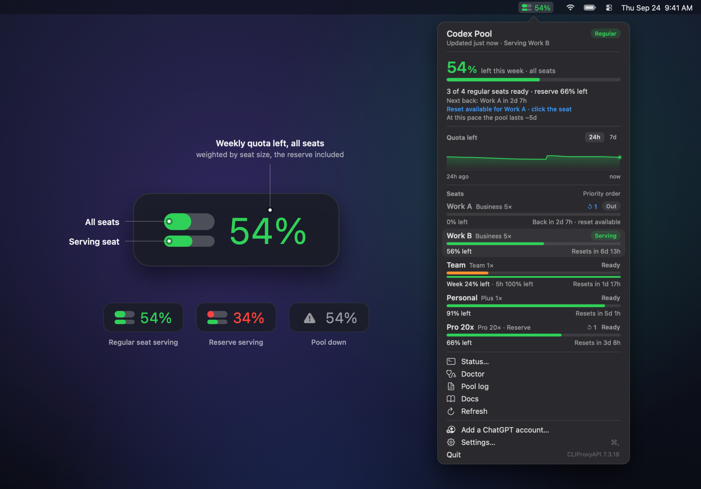
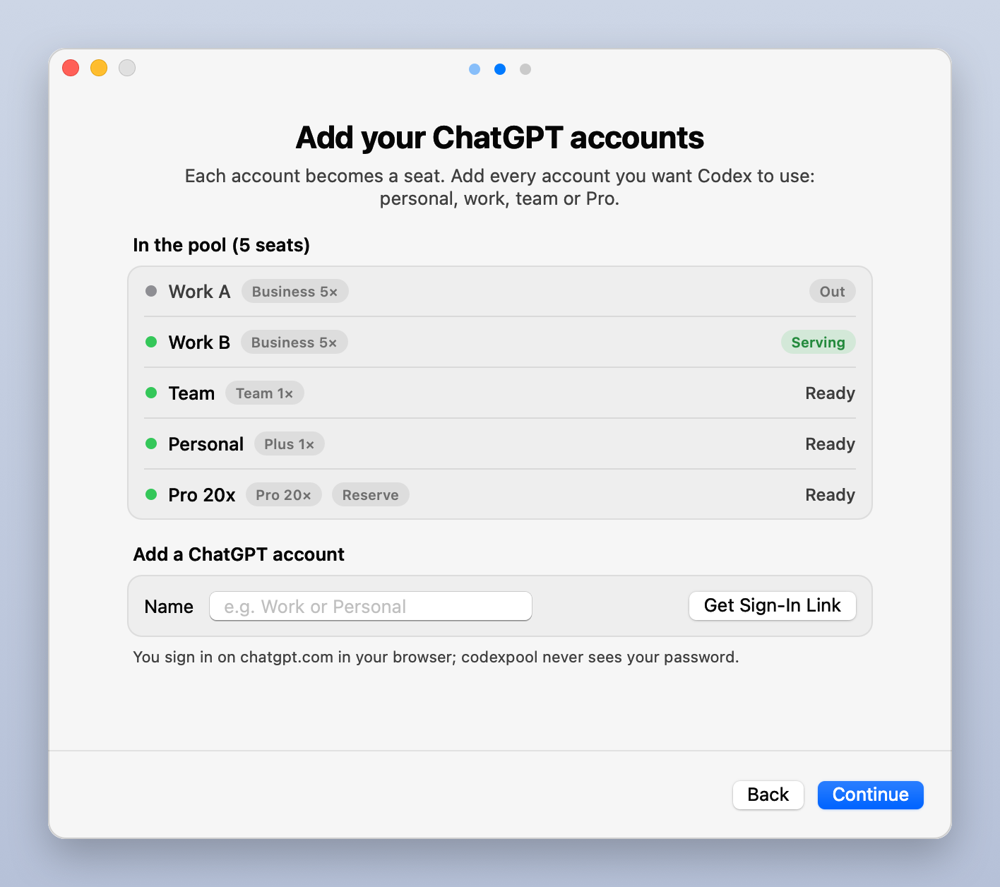
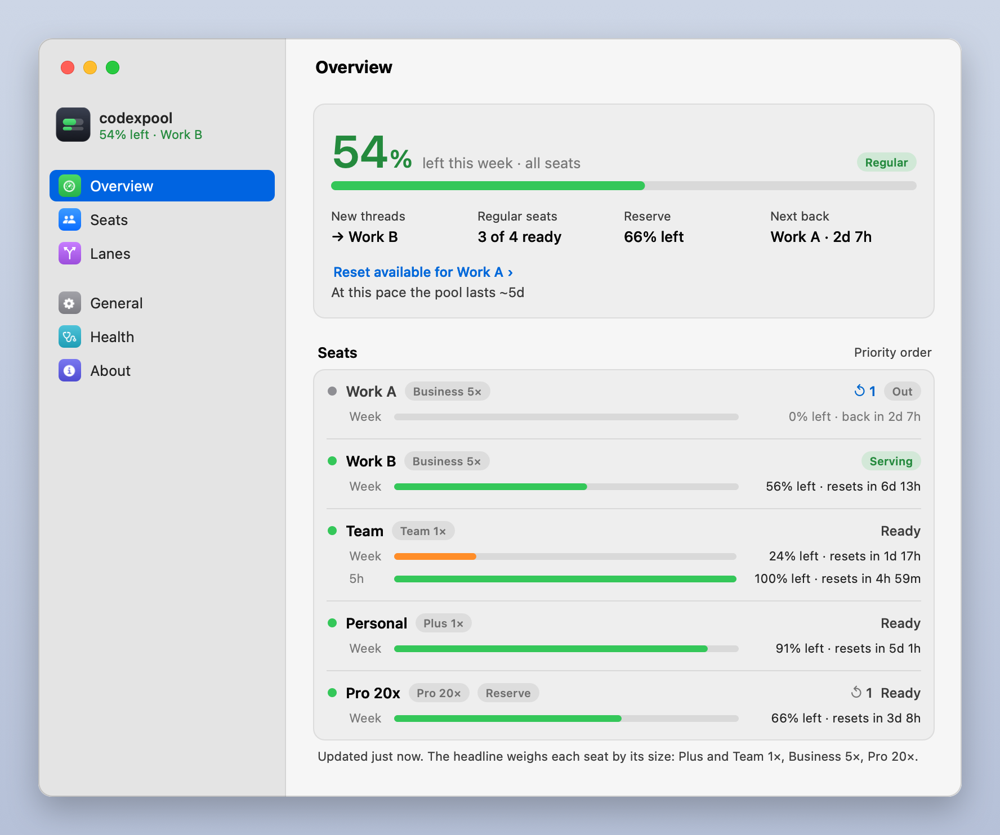

# codexpool

**Every ChatGPT seat you have, behind one Codex.**

[](LICENSE)
[](#requirements)
[](https://github.com/memfactorduke/codex-load-balancer/actions/workflows/ci.yml)



codexpool pools your ChatGPT accounts behind the Codex desktop app and CLI on your Mac. When the seat in use hits
its usage limit, the next one picks up the same request, in the middle of a turn if need be, so you keep one app
and one thread history and never switch accounts. A menu bar meter shows how much of the week's quota is left
across all of them. More on the [website](https://memfactorduke.github.io/codex-load-balancer/).

The popover shows serving and ready accounts first and unavailable accounts last, while preserving the
pool's routing priorities. **Compact** is the default: two lines per account, with plan size, status, quota
and reset time. Select **Full** above the accounts to see every quota bar. The usage graph has its own
collapse toggle: click its title to hide or show it in either view. It starts expanded. The app remembers
both choices; hovering a compact row shows all its limits.
The optional Claude CLI view also shows automatically detected plan sizes;
see [the Claude integration](addons/sienna/README.md).

## Install

You need macOS 13 or later, the Codex desktop app (signed in) and two or more ChatGPT accounts with Codex access.
Paste this into Terminal:

```sh
curl -fsSL https://raw.githubusercontent.com/memfactorduke/codex-load-balancer/main/install.sh | bash
```

<a name="set-it-up-with-your-coding-agent"></a>**Or set it up with your coding agent.** Paste the prompt below into
your coding agent (Codex or another) running on the Mac you are setting up. It runs the installer, asks what
to call each ChatGPT account, hands you a sign-in link for each one and checks the result: all you do is sign in.
It also works when you are not at that Mac's screen: through Screen Sharing, an SSH tunnel, or by sending the
agent the address the sign-in ends on, from any device.

<details>
<summary>The setup prompt for your coding agent</summary>

```text
Set up codexpool on this Mac (https://github.com/memfactorduke/codex-load-balancer): it pools my ChatGPT
accounts behind the Codex app and CLI. This message is my go-ahead to install it (and uv, Astral's
Python manager, if this Mac has no Python 3.11 or later), sign in my accounts and mark the reserve.
Rules: no sudo; never ask for my Mac or ChatGPT password; never read ~/.codexpool/auth/ or
~/.codex/auth.json and never print a token; ask me before `codexpool uninstall`; if a step fails, stop
and show me the error and the fix it prints, don't retry in a loop; if the install stops at the
Keychain, ask me to unlock it (I run `security unlock-keychain` myself) and wait. You can't answer
terminal prompts, so use exactly the commands below (not `codexpool setup`, which needs a terminal).
They need the network, the login Keychain and files outside your workspace: if you have a sandbox, ask
me to approve running them outside it.

1. Ask me in one message: a short name for each ChatGPT account (for example Personal, Work, Team), in
   the order to use them; which one is the reserve, used last (usually the biggest plan); and whether
   I'm at this Mac's screen or somewhere else (over SSH, or you run on a Mac I'm not sitting at). If I'm
   not at the screen, tell me first: this Mac has to be logged in to its desktop as this user and stay
   logged in (log in once through Screen Sharing, and again after a restart), because the pool runs as
   launchd agents in that login.
2. Install. Run this in the background (your tool's background mode, or `nohup ... &`), since the first
   install builds the pool from source and can take up to 15 minutes, and wait for it to end:
     (curl -fsSL https://raw.githubusercontent.com/memfactorduke/codex-load-balancer/main/install.sh | bash -s -- --yes --no-gui) > /tmp/codexpool-install.log 2>&1
   Then read the log. When the install worked, its last line starts with "Docs:"; otherwise it stopped,
   so show me its last lines (the "✗" line and the fix under it). If `codexpool` isn't on your PATH, use
   ~/.local/bin/codexpool. Run `codexpool version`: if it is older than 1.1.0, stop and tell me. The
   closing doctor check in the log reports 0 seats and a warning under "Codex app" (Codex keeps its own
   login until the first seat): both expected until step 3. If a Setup assistant window opens on this
   Mac, I can close it. Then read ~/.codexpool/AGENTS.md and follow it.
3. Sign in each account, one at a time. Run this in the background too and read its log:
     codexpool login "<Name>" --no-open < /dev/null > /tmp/codexpool-login.log 2>&1
   Send me the https:// link from the log and tell me: first close every private window left from the
   previous account (a browser's private windows share one session until the last one closes), then open
   the link in a new private (incognito) window, sign in to THAT account and pick its workspace; the
   link expires after about 5 minutes (then run the login again). The login has ended when the log has a
   line starting "seat " (it worked) or "login did not complete" (it did not; the reason follows). If
   the log also has a line starting "That was", the browser signed in to an account that is already in,
   and nothing was added: tell me, and run this login again.
   If I'm not at this Mac's screen, the sign-in ends at http://localhost:1455 on THIS Mac. Tell me to do
   one of these. Open the link in a browser on this Mac through Screen Sharing. Or keep this running on
   my own computer and open the link there (it needs Remote Login on in this Mac's Sharing settings):
     ssh -N -L 1455:localhost:1455 <user>@<address>
   Fill it in for me: <user> is `whoami`; on the same network, <address> is `scutil --get LocalHostName`
   plus .local. If the page already failed, I start the tunnel and reload it while the login is still
   waiting. Or, from any device (a phone too): I open the link there and sign in, and when the page
   fails to load, I send you its full address (it starts http://localhost:1455/auth/callback?code= and
   holds a one-time code, not a token); you then run `curl -s "<that address>" > /dev/null` on this Mac
   while the login is still waiting.
4. Run `codexpool reserve "<Reserve name>"` (skip it if I named none), then `codexpool doctor` (it must
   end with OK) and `codexpool status --live`.
5. Report the seat table and the doctor result, then tell me to quit the Codex app fully (⌘Q) and reopen
   it (through Screen Sharing if I'm not at the screen). If you are Codex: this thread keeps working
   until then and is still there afterwards; from then on it and every new thread go through the pool.
6. Ask whether I also want subagent lanes (models from other providers for token-heavy subagent work).
   If yes, follow "Paste this to your agent" in ~/.codexpool/docs/LANES.md.
```

</details>

With the one-liner, you then add your accounts in the Setup assistant and reopen Codex:

1. The installer checks your Mac and builds the pool from source, then opens the **Setup assistant**. Codex keeps
   working normally until you add your first account.
2. **Add your ChatGPT accounts** there, one by one; each becomes a seat. The assistant puts each sign-in link on
   the clipboard; for an account your browser is not signed in to, paste it into a private window. The first account
   you add points Codex at the pool.
3. **Quit the Codex app fully (⌘Q) and reopen it.** Your threads are all there, and the meter sits next to the
   clock. From then on the **Settings window** (Settings… in the menu bar, or `codexpool gui`) manages your seats.

<p>
  
  
</p>

The installer never uses sudo and never edits your shell profile. If your Mac has no Python 3.11 or later, it
asks before installing [uv](https://docs.astral.sh/uv/), which provides one. To see the plan first, replace the
final `bash` with `bash -s -- --dry-run`: it prints every step and changes nothing. Its other options are
`--version TAG`, `--no-gui` (don't open the Setup assistant) and `--yes`. [Read the script first](install.sh).
Run it again at any time to upgrade in place.

**Prefer the terminal?** `codexpool setup` walks through the same steps in Terminal: it checks that the pool
answers, signs in one ChatGPT account after another, asks whether each one is the reserve, runs `codexpool doctor`
and offers to reopen the Codex app. To add seats one command at a time, see
[Adding seats by hand](#adding-seats-by-hand).

**Manual install from a clone.** The same install without the one-liner (details in
[Setup in detail](#setup-in-detail)):

```sh
git clone https://github.com/memfactorduke/codex-load-balancer.git
cd codex-load-balancer                # from the ZIP download: cd codex-load-balancer-main
./bin/codexpool install --dry-run     # optional: print every step without changing anything
./bin/codexpool install
~/.local/bin/codexpool setup          # or the Setup assistant: ~/.local/bin/codexpool gui setup-welcome
```

Once `~/.local/bin` is on your `PATH`, plain `codexpool` works.

## Products

- **Codex Desktop/CLI:** the ChatGPT seat pool described below.
- **Claude CLI:** a separate [cswap-powered account switcher](addons/sienna/README.md)
  for Claude Code in Terminal. It does not configure the Claude desktop app.

## Features

- **Automatic failover, mid-thread.** A seat that runs out is replaced on the same request after a pause of a
  second or two. One seat serves at a time, in your order, so resets are staggered and prompt caching keeps
  working. Or let the guard put the seat whose weekly quota resets soonest first, so none of it goes to waste.
- **One thread history.** Codex keeps its built-in provider, so every thread stays where it was. Encrypted
  reasoning and native compactions carry across seats, and `codexpool selftest` checks any pair of yours.
- **Menu bar meter.** One number for the week across every seat, weighted by seat size: blue while a regular
  seat serves, red once the reserve has taken over, grey when the pool is down. It can count used instead, or
  leave the reserve out.
- **Settings window and Setup assistant.** Native macOS windows to add accounts and to rename, resize, reorder,
  reserve, enable, disable or remove seats, redeem resets, test lanes and read the health report, without a
  terminal.
- **Banked resets.** Free resets banked on an account show on its seat, and one click redeems one. codexpool
  never buys a reset.
- **Add-ons.** A second pool for another tool can be added as an add-on ([docs/ADDONS.md](docs/ADDONS.md)); none
  ship here.
- **Subagent lanes** (optional). Token-heavy subagent work, such as codebase sweeps and bulk edits, can run on
  models from other providers, with fallback between them. The main agent stays on your seats.
- **Secure by design.** Loopback only, an origin gate compiled into the pool that refuses browser requests, a
  management key in the Keychain, and seat tokens that only the pool holds. No telemetry.
- **A doctor.** `codexpool doctor` checks the whole setup and says how to fix every problem it finds.

Also: a credit guard that parks seats to limit further spending, automatic refresh of seats blocked by auth
errors, notifications when the pool changes seat, pool upgrades that are tested before use and rolled back on
failure, and an uninstall that restores your Codex config.

## Contents

- [How it works](#how-it-works) and [Setup in detail](#setup-in-detail)
- [Everyday use](#everyday-use)
- [The headline number, weights and the reserve](#the-headline-number-weights-and-the-reserve)
- [Load balancing: which seat new threads get](#load-balancing-which-seat-new-threads-get)
- [Resets](#resets) and [How a seat change works](#how-a-seat-change-works)
- [Subagent lanes (optional)](#subagent-lanes-optional)
- [Security model](#security-model) and [Terms of service and risk](#terms-of-service-and-risk)
- [Configuration](#configuration), [Upgrade](#upgrade), [Uninstall](#uninstall)
- [FAQ](#faq), [Troubleshooting](#troubleshooting), [Credits](#credits), [License](#license)

More: [docs/ARCHITECTURE.md](docs/ARCHITECTURE.md) (why it is built this way),
[docs/MENUBAR.md](docs/MENUBAR.md) (the menu bar app, the Settings window and the Setup assistant),
[docs/LANES.md](docs/LANES.md) (subagent lanes), [docs/ADDONS.md](docs/ADDONS.md) (add-ons),
[docs/TROUBLESHOOTING.md](docs/TROUBLESHOOTING.md),
[CHANGELOG.md](CHANGELOG.md), [CONTRIBUTING.md](CONTRIBUTING.md), [SECURITY.md](SECURITY.md) and
[AGENTS.md](AGENTS.md) (for coding agents).

## How it works

```
 Codex app / codex CLI        stock, still signed in to its own account
        │   ~/.codex/config.toml:  openai_base_url = "http://127.0.0.1:8319/v1"
        ▼
 CLIProxyAPI on 127.0.0.1     built from its upstream release + one file, the origin gate
        │   one OAuth login per seat · fill-first by priority · a thread stays on its seat
        ▼
 chatgpt.com/backend-api/codex, as whichever seat is serving
```

The only thing in the request path is [CLIProxyAPI](https://github.com/router-for-me/CLIProxyAPI), an
open-source proxy that tracks Codex releases closely. codexpool builds it from the upstream release source and
adds one file, [`build/codexpool_gate.go`](build/codexpool_gate.go), which refuses browser and non-loopback
requests, plus a one-line hook in `cmd/server/main.go` that installs it. Codex reaches the pool through its
built-in `openai` provider with one line of config, so every existing thread stays visible and nothing in Codex is
patched.

Beside the request path:

| Piece | What it does |
|---|---|
| **guard** (`codexpool guard`, every 60 s under launchd) | Polls each seat's usage and banked resets, parks a seat that would start spending credits, retries seats blocked by auth errors (and asks for a new sign-in at once when OpenAI ended one), notifies you when the pool changes seat, reaches the reserve or runs dry, and writes `state/status.json` plus a usage sample every 10 minutes to `state/history.jsonl`. |
| **menu bar app** (`menubar/codexpool_menubar.py`, under launchd) | A native macOS item next to the clock with a popover for every seat. It reads those two files: no Keychain, no network. |
| **Settings window and Setup assistant** (`menubar/codexpool_settings.py`) | Opened on demand: from the menu bar, by `codexpool gui`, or by the installer. Every change they make is a `codexpool` command. Same rules as the menu bar app. |
| **`codexpool`** | The command you use: install, setup, add seats, status, doctor, resets, upgrades, lanes. |

If the guard, the menu bar app or the Settings window stops, requests keep flowing. If the pool stops, launchd
restarts it.

## Setup in detail

### Requirements

- **A Mac with macOS 13 or later.** Built and tested on Apple silicon. Intel Macs should work but are untested.
  Linux and Windows are not supported (launchd, the Keychain and AppKit are macOS-only).
- **The Codex desktop app** from OpenAI (`ChatGPT.app` or `Codex.app`, found by its bundle id), signed in.
  codexpool uses the `codex` CLI inside the app for its self-test; a `codex` on your `PATH` also works.
- **Two or more ChatGPT seats with Codex access**, for example Plus, Pro, Business or Team accounts or
  workspaces that you are entitled to use.
- **Python.** The one-line installer finds a Python 3.11 or newer on your Mac, or gets one through uv. From a
  clone you need a working `python3` (3.9 or newer) to start the installer, plus Python 3.11+ or
  [uv](https://docs.astral.sh/uv/) for codexpool itself. The installer makes its own venv in `~/.codexpool/.venv`
  (with uv it fetches Python 3.13 itself). On a fresh Mac, `/usr/bin/python3` is only a stub that offers to
  install the Xcode Command Line Tools; get a real one from `xcode-select --install`, Homebrew
  (`brew install python@3.13`) or python.org, or use uv alone (see below).
- **git** to clone (it comes with the Command Line Tools), or download the ZIP from GitHub. The one-liner needs
  neither.
- **Internet access during install** (GitHub, go.dev, the Go module proxy and checksum database, and PyPI for
  PyObjC; astral.sh only if uv has to be installed) and about 1 GB of disk, mostly the Go toolchain used to
  build CLIProxyAPI. No Xcode, no Homebrew and no Go install needed.

**Installing from a clone?** Check first that Python and git run:

```sh
python3 --version && git --version
```

If either says "You have not agreed to the Xcode license agreements", run `sudo xcodebuild -license accept`
first. If `python3` offers to install the Command Line Tools, let it (or install Homebrew Python or uv). With uv
and no usable `python3`, start the install with
`uv run --managed-python --no-project --python 3.13 python ./bin/codexpool install`.

### What the installer does

Budget 20 to 30 minutes for five seats, most of it signing in. The install itself takes a minute or two on a
fast connection (measured on an Apple silicon Mac: 8 s for the Go download, 25 s to build CLIProxyAPI and run
the gate self-test); each seat's sign-in takes a minute or two after that.

The one-liner (`install.sh`) checks the Mac (macOS 13 or later, not run as root, the Codex app), finds or gets a
Python 3.11+, downloads the source of the latest release from GitHub, runs `bin/codexpool install` from it and
opens the Setup assistant. `codexpool install`, from the one-liner or a clone, checks first and then does seven
steps, each safe to re-run:

1. Preflight: macOS, the Codex app, Python 3.11+ or uv, network, a free port (8319). It copies the code to
   `~/.codexpool`, writes `~/.codexpool/settings.json` with the defaults and creates the venv. If it started
   under an older Python, it restarts itself under the new venv and prints the header and the preflight again.
2. Downloads the official Go toolchain for macOS from go.dev and checks its sha256.
3. Builds the latest CLIProxyAPI release from source with the origin gate, runs the gate self-test on a scratch
   port, and points `bin/current` at it.
4. Mints a random management key into the Keychain (`codexpool-management-key`) and writes `config.yaml`
   (loopback, fill-first, 24 h session affinity).
5. Installs the three launchd agents (pool, guard, menu bar), plus the lane bridge when a lane needs it, and
   PyObjC for the menu bar app and the Settings window. macOS shows a "Background Items Added" notification; they
   appear in System Settings → General → Login Items & Extensions under names like `python3.13` and
   `cli-proxy-api`. Leave them on: with the pool switched off, Codex can't reach the model.
6. Backs up `~/.codex/config.toml` and records the keys it may change. Once the pool has a seat, it sets
   `openai_base_url = "http://127.0.0.1:8319/v1"`. On a first install that waits for your first sign-in, which
   sets it instead, so Codex keeps working on its own login until the pool can serve it (and while the pool has
   no seat, a line that already points at it goes back to what it was before install). If your config has
   `model_provider` or `model_catalog_json`, it warns; re-run with `--fix-config` to remove them (uninstall puts
   them back).
7. Writes the `codexpool` command to `~/.local/bin` and runs `codexpool doctor`.

The doctor run at the end reports "0 Codex seats in the pool" as a problem and warns that Codex still talks to
OpenAI directly: both expected, since you haven't added a seat yet. **Codex keeps working normally until you add
your first account.** Add seats now (the Setup assistant, `codexpool setup` or `codexpool login`): the first
sign-in points Codex at the pool and says so, and then you quit and reopen the Codex app. To undo the install,
run `codexpool uninstall --yes`. The menu bar app also opens the Setup assistant by itself the first time it finds
the pool running with no seats.

If `~/.local/bin` is not on your `PATH`, the installer says so: add it and open a new terminal.

### Adding seats by hand

The Setup assistant and `codexpool setup` add seats in the order you add them, and the reserve last. To add them
by hand instead, run one `login` per seat. Each `login` opens the ChatGPT sign-in; sign in and pick the workspace
for that seat. Higher priority is used first, so give the seat you want drained first the highest number and the
reserve the lowest. Without `--priority`, a new seat fills after the seats already in the pool and before the
reserve.

```sh
codexpool login "Work A" --priority 400
codexpool login "Work B" --priority 300 --no-open    # another account: open the printed link in a private window
codexpool login Team     --priority 200 --no-open
codexpool login Personal --priority 100 --no-open
codexpool login "Pro 20x" --priority 10 --no-open
```

Your browser is usually signed in to one account. For every other account use `--no-open` and open the printed
link in a private window; the link expires after a few minutes. Whenever `login` prints the link (with `--no-open`
or `--device`, or when the browser did not open), it also copies it to the clipboard and says so under it, so you
can paste it straight in (`--no-copy` leaves the clipboard alone, and `CODEXPOOL_NO_CLIPBOARD=1` does that for
every sign-in, `codexpool setup` included). `--device` uses a device code instead, which only works where
device-code sign-in is enabled in the account's ChatGPT security settings. The label is optional: without one,
the seat is named from its email and plan (`codexpool label` renames it later). `login` prints the seat's `plan=`,
which sets its default size. Signing in to an account that is already a seat refreshes its login and keeps its
name; with another name it also prints "That was <seat> once more": the browser used that account again, and
nothing was added.

The first `login` points Codex at the pool (it sets `openai_base_url` and prints "Codex now uses the pool"). If
you changed `openai_base_url` by hand since the install, it leaves your value and says so; `codexpool install`
then makes the switch.
Then **quit the Codex app fully (⌘Q) and reopen it**, so it picks that up. The app still shows its own account and
its own usage meter; that is expected.

### Sizes and the reserve

`codexpool status` shows each seat's size in the `size` column. The default comes from the plan that `login`
printed:

| `plan=` | Size |
|---|---|
| `plus` | 1 |
| `prolite`, `self_serve_business_prolite` (shown as `business`) | 5 |
| `pro` | 20 |
| anything else (`team`, `enterprise`, …) | 1 |

```sh
codexpool weight Team 2          # only if a seat's default size is wrong for its quota
codexpool reserve "Pro 20x"      # the fallback seat: red when it serves
```

The Seats pane of the Settings window does the same with a Size menu and a Reserve switch.

### Check that Codex goes through the pool

Send Codex one prompt. Then:

- the top seat shows **Serving** in the menu bar, or `active` in `codexpool status`;
- `codexpool logs -n 20` shows the request;
- `codexpool doctor` ends with `OK` (the Health pane in the Settings window shows the same report).

From now on, use Codex as usual.

## Everyday use

Most of this is also in the menu bar popover and the [Settings window](docs/MENUBAR.md#the-settings-window).

| You want to | Run |
|---|---|
| See seats, usage and resets | the menu bar, or `codexpool` (same as `codexpool status`; `--live` polls every seat now, `--json` for scripts) |
| Add ChatGPT accounts, guided | `codexpool setup` in the terminal, or `codexpool gui setup-welcome` for the Setup assistant |
| Check everything is healthy | `codexpool doctor` (must end with `OK`; `--json` prints the checks as JSON for scripts) |
| Open the Settings window | `codexpool gui`, or `codexpool gui <pane>` for `overview`, `seats`, `balancing`, `lanes`, `general`, `health`, `about`; `--pool ID` picks the pool those panes show when an add-on provides a second one |
| Change what the menu bar number shows | `codexpool set display left` or `used`, `codexpool set headline all` or `regular` (`codexpool set` alone prints every setting it changes) |
| Use a banked free reset | click the seat in the menu bar → **Use reset now…**, or `codexpool reset <seat>` |
| Take a seat out / put it back | `codexpool disable <seat>` / `codexpool enable <seat>` |
| Change the fill order | `codexpool order <seat> <seat> ...` (first used first), or one seat: `codexpool priority <seat> <n>` (higher first) |
| Use the seat whose week resets soonest first | `codexpool set balancing reset` (`priority` goes back to your order; see [Load balancing](#load-balancing-which-seat-new-threads-get)) |
| Rename, resize, mark the reserve | `codexpool label <seat> <name>`, `codexpool weight <seat> <n>`, `codexpool reserve <seat>` (moves it last in the fill order; `--off` to undo) |
| Fix a seat that says blocked | `codexpool refresh <seat>`, then if needed `codexpool login "<Label>" --priority <n> --no-open`; when it says "OpenAI ended this sign-in", only the login helps |
| Remove a seat | `codexpool remove <seat> --yes` (deletes its login file; does not sign the account out). Removing the last one puts Codex back on its own login until you add a seat |
| Watch requests | `codexpool logs -f` (`--guard` for the guard's log) |
| Restart the pool | `codexpool restart` |
| Test that threads move between two seats | `codexpool selftest <from> <to> --compact` |
| Upgrade CLIProxyAPI | `codexpool upgrade latest` |
| Run subagents on models from other providers | `codexpool lane` to list lanes (`lane list --json` for scripts); `lane add`, `lane edit`, `lane remove`, `lane apply`, `lane test` (see [Subagent lanes](#subagent-lanes-optional)), or the Lanes pane of the Settings window |
| Print the version | `codexpool version` (or `codexpool --version`) |

`<seat>` is a label (quote names with spaces: `"Work A"`), a seat file name, an email, or any part of one of
those that matches a single seat.

A re-login of an existing seat rewrites its login file, which is where the priority lives, so pass `--priority`
again. The menu bar's **Re-login…** and the Settings window's **Sign In Again…** do that for you.

## The headline number, weights and the reserve


The menu bar shows one percentage: how much of this week's quota is **left** across **all** your seats, as an
average weighted by seat size. It counts down as you work and jumps back up when a seat's week resets.

- **Weight** is a seat's size relative to Plus. The default comes from the plan in its login: `plus` 1,
  `prolite` and `self_serve_business_prolite` 5, `pro` 20, anything else (including `team`) 1. `codexpool status`
  shows it in the `size` column and the popover as `5×`. Change it with `codexpool weight <seat> <n>` (any
  positive number).
- **Reserve** seats (`codexpool reserve <seat>`) count like the others. The popover also shows the reserve's own
  figure on the line below the number ("reserve 66% left").
- Seats you turned off are left out. A seat that is out or blocked and reports no numbers counts as spent (0% left).

In the screenshot at the top: Work A 5× has 0% left, Work B 5× 56%, Team 1× 24%, Personal 1× 91% and the
Pro 20× reserve 66%, which gives (0 + 280 + 24 + 91 + 1320) / 32 = **54%** left. Hover over the number in the
popover to see this breakdown, seat by seat. `codexpool status` prints it under its table:

```
Left this week, weighted by size: Work A 5× 0% · Work B 5× 56% · Team 1× 24% ·
    Personal 1× 91% · Pro 20x 20× 66% reserve → 54% left
```

Two settings in `~/.codexpool/settings.json` change what the number means (see [Configuration](#configuration)).
`codexpool set headline regular` and `codexpool set display used` change them for you, as does the General pane
of the Settings window:

- **`"headline": "regular"`** leaves reserve seats out, so the number covers only the seats meant to be used
  first. In the example that is (0 + 280 + 24 + 91) / 12 = 33% left.
- **`"display": "used"`** counts up instead: every number shows how much is used (46% in the example), and bars
  fill rather than drain. With both settings, the number is the regular seats' weekly use: 67% used.

After `codexpool set`, the menu bar shows the change within a few seconds. After an edit by hand, `codexpool status`
shows it at once and the menu bar after the guard's next pass (within a minute).

The colour tells you what is serving:

- **Blue** (the Codex pool's colour): a regular seat is serving.
- **Red**: the reserve is serving, which means your regular seats are spent for now, or every seat is out.
- **Grey with a warning triangle**: the pool is down, the guard has not reported for 3 minutes, or it has no seats.

With an add-on that provides a second pool, the item shows a second number for it, by the same rules.

The small meter left of the number has two bars: the number itself on top (red, like the number, while the
reserve serves), the serving seat's week below. Both drain as the quota is used (or fill, with
`"display": "used"`).

Order comes only from priority, so the reserve needs the lowest. `codexpool reserve <seat>` moves the seat below
every regular seat when it would otherwise be used before one of them, and `codexpool reserve <seat> --off` moves
it back above the reserves. The Setup assistant, `codexpool setup`, and `codexpool login` without `--priority`
put a new seat after the seats already in the pool and before the reserve, moving the reserve down when there is
no room left above it. `codexpool order` and `codexpool priority` still set any order you like, and
[load balancing](#load-balancing-which-seat-new-threads-get) can keep it sorted by reset time for you.

## Load balancing: which seat new threads get

The pool gives every new thread to the first seat in the fill order that can serve, and keeps the thread there.
Two settings decide that order (`"balancing"` in `settings.json`, or the Balancing pane of the Settings window):

- **Your order** (`codexpool set balancing priority`, the default). The first seat is used until it runs out,
  then the next. This is the best choice for prompt caching, and your big seat can wait as the reserve.
- **Soonest reset first** (`codexpool set balancing reset`). Every minute the guard puts the regular seats in the
  order of their weekly resets, the soonest first: quota that is about to reset is used before it goes to waste.
  A seat without a weekly window counts by its 5-hour window, seats without usage data go after the others in
  your order, and seats that are out, parked, blocked or off stay where they are until they serve again. The
  reserve stays last. The guard changes priorities only when the order is wrong (two resets within five minutes
  of each other count as a tie), logs one line in `codexpool logs --guard` and never notifies. `codexpool status`
  shows the mode in its first line and each seat's reset in its note.

Either way, **running threads stay on their seat** (the pool's session affinity); only new threads follow a new
order.

Set your order in one go:

```sh
codexpool order "Work A" "Work B" Team     # these first, in this order; the other seats keep theirs after them
```

`order` gives the seats priorities from 1000 down in steps of 10. Seats you don't name keep their order after
the named ones, and reserve seats always come last, in their own order (`codexpool reserve <seat> --off` makes
one regular). `seats.json` keeps the order as yours (`manual_priority`, which `codexpool priority` also writes):
under "Soonest reset first" the guard sorts the pool's priorities, and your order comes back on the guard's next
pass after `codexpool set balancing priority`. While balancing is `reset`, `order` and `priority` change only
your saved order and say so: the pool keeps filling soonest reset first until you switch back.

## Resets

Some ChatGPT accounts receive free usage resets that stay banked on the account until they expire. codexpool
tracks them for every seat and lets you spend one when it helps.

- **Tracked.** The guard checks each seat's banked resets every 10 minutes. `codexpool status` adds
  "1 reset banked" to the seat's note. In the menu bar the seat shows `↺ 1`, blue when the seat can't serve, and
  when an out seat has a reset the popover says "Reset available for Work A · click the seat".
- **One click.** Click the seat and choose **Use reset now… (1 banked, expires Oct 3)**. The app asks first, then
  runs `codexpool reset <seat> --yes`. The seat's weekly and 5-hour limits go back to full and it can serve again
  at once. **Redeem Reset…** in the Settings window's Seats pane does the same.
- **From a terminal.** `codexpool reset <seat>` shows the seat's current usage, how many resets are banked and
  which one it will use, then asks `[y/N]`. `--yes` skips the question.

What a reset does: it redeems the soonest-expiring banked credit through ChatGPT's reset-credit endpoint, then
clears the pool's cooldown for that seat and refreshes its numbers. **It never buys a reset**: codexpool only
redeems credits the account already holds and has no code for the paid flow. If the seat's usage doesn't need a
reset, ChatGPT declines and the credit is kept. A retry after a network error reuses the same request id, so one
click cannot spend two credits. Every attempt is logged to `~/.codexpool/state/resets.jsonl`.

## How a seat change works

A seat that runs out answers `429 usage_limit_reached` before it produces any output. CLIProxyAPI marks that
seat as cooling down until its reset time and replays the same request on the next seat, so a turn in progress
continues after a pause of a second or two. Codex itself treats a 429 as final, which is why the retry happens
in the pool.

Threads stay on the seat they started on (session affinity, 24 h) and move only when that seat can't serve.
Subagents ride their parent's seat.

**Threads survive the move.** A Codex thread carries encrypted reasoning items and, once compacted, an encrypted
compaction, both issued under the seat that produced them. In live tests another seat accepted both, in both
directions, between a Business workspace seat and a personal Pro seat. Other pairs haven't been tested, so check
yours:

```sh
codexpool selftest "Work A" "Pro 20x" --compact
```

The self-test runs a real throwaway thread on the first seat (with encrypted reasoning, and with `--compact` a
forced native compaction), moves it to the second seat and checks that it continues. `--model` picks the model
for the test turns (`codexpool selftest --help` shows the default). It prints `PASS`, `FAIL` or
`INCONCLUSIVE`, records the result in `state/selftests.json`, spends a little quota, and pauses your other seats
for 1 to 3 minutes, so run it when you are not in the middle of a task. `codexpool doctor` also counts any
cross-seat decryption errors in the pool log.

**Seats with credits.** A seat holding a credit balance does not return 429 at 100%: it keeps answering and
spends credits. The pool can't tell, so the guard parks such a seat (takes it out of rotation until its limit
resets) and notifies you. `codexpool enable <seat>` overrides that until the next reset. Turning off auto top-up
on every seat avoids the question.

## Subagent lanes (optional)

codexpool can also serve models from other providers as native Codex subagents, called lanes. The main agent
stays on your seats. For work that spends many tokens but doesn't need the most capable model (codebase sweeps,
bulk edits, log digging, second opinions), it spawns a lane subagent, which runs on, for example, an xAI model
and falls back to an OpenCode model when the first is unavailable or used up. A lane subagent's tokens count
against those providers' quotas or bills, not your seats'.

```sh
codexpool lane login xai            # or, for a key-based provider: codexpool lane key opencode-go
codexpool lane add bulk --member xai:<model> --member opencode-go:<model> --role "<what the lane is for>"
codexpool lane test bulk            # a real subagent per member; spends a little quota
```

Then start a new Codex thread. `codexpool lane apply` (which `lane add` runs) generates everything from
`~/.codexpool/lanes.json`: a marked block in the pool's `config.yaml`, a small local bridge for providers that
need their requests adapted (a fourth launchd agent), a Codex role file per lane in `~/.codex/agents/`, and a
short block in `~/.codex/AGENTS.md` that tells the main agent what each lane is for. The Codex model picker shows
one entry per lane, under the lane's name ("Bulk" for `bulk`), with its members under the hood; `lane add --display
"<name>"` gives it a name of your own.
Seat traffic never touches any of it. Without `lanes.json`, nothing changes. The Lanes pane of
the Settings window creates, edits and deletes lanes (the members in fallback order, a model list from each
provider, the xAI sign-in and provider keys) and runs `lane test`; in a terminal, `codexpool lane edit` changes a
lane in place (`--add-member`, `--move-member ID --to POS`, `--effort`, `--rename`, ...) and `lane providers` and
`lane models <provider>` show what you can pick from.

[docs/LANES.md](docs/LANES.md) covers the supported providers, setup, what `lane apply` generates and why, fallback
between providers, the known limits, privacy, and a prompt you can give your own coding agent to set lanes up.

## Security model

The pool holds working logins for all your seats, so it is locked down.

**Loopback only.** CLIProxyAPI listens on `127.0.0.1`, remote management is off and its web control panel is
disabled. Nothing on your network can reach it.

**No client key, and an origin gate instead.** The Codex app can only send its own ChatGPT bearer, so the pool
accepts loopback requests without a key (`api-keys: []`); it ignores the app's bearer and substitutes the serving
seat's token. On its own that would let any web page in your browser use the pool, because CLIProxyAPI answers
every origin with CORS `*`, and a few keyless management calls from a page would get loopback banned from the
management API. The origin gate refuses any request whose `Host` is not a loopback name (DNS rebinding) or that
carries browser provenance (an `Origin` other than the Codex app's own `app://-`, or a `Sec-Fetch-Site` other
than `none`). It runs before CLIProxyAPI's logging, CORS, auth and routes, WebSocket upgrades included, so a
rejected request never reaches them. Every build passes an 11-case gate self-test before it is used, and
`codexpool doctor` probes the running gate (a Codex-like request must get 200, a browser-like one 403).

What remains trusted: any non-browser program running as you can send model requests through the pool, just as
it could read `~/.codex/auth.json`. Other user accounts on the same Mac can reach loopback too, so on a shared Mac
they can use the pool as well.

**Management key.** A random key, stored in your login Keychain as `codexpool-management-key` and written there
through `security -i` so it never appears in the process list. CLIProxyAPI replaces it in `config.yaml` with a
hash on first start. codexpool's calls to the pool bypass any HTTP proxy so the key never leaves loopback. The
menu bar app and the Settings window never touch the Keychain.

**Seat logins and token rotation.** Each seat's OAuth login lives in `~/.codexpool/auth/` (directory mode 700),
and only the pool refreshes it. codexpool reads nothing from a seat file except its identity claims (email, plan,
account id) and never prints or sends tokens: usage and reset calls go through the pool, which inserts the token
itself. The rules that keep this working:

1. **Add seats only through codexpool** (the Setup assistant, `codexpool setup` or `codexpool login`). Never copy
   a seat file or `~/.codex/auth.json` anywhere, and never point another tool at `~/.codexpool/auth`. ChatGPT
   refresh tokens rotate on use: when two programs hold the same login, one refresh invalidates the other copy
   and one of them gets signed out (`refresh_token_reused`).
2. **Keep the Codex app signed in.** Its own login is separate from the seat logins, even for the same account,
   and still serves its usage meter, cloud tasks, plugins and sign-in. Signing out revokes it.
3. **Don't add `model_provider` or `model_catalog_json` to `~/.codex/config.toml`.** A custom provider hides every
   existing thread, and a static catalog freezes the model picker. Only `openai_base_url` points at the pool.

**What leaves your Mac.** Model traffic and usage/reset calls go to chatgpt.com through the pool, and adding a
seat signs in with OpenAI. Install and upgrades download from GitHub, go.dev, the Go module proxy and checksum
database (proxy.golang.org, sum.golang.org) and PyPI (PyObjC), plus astral.sh for uv if your Mac has no Python
3.11 or later. If you set up [lanes](#subagent-lanes-optional), lane subagents' requests go to the lane providers
you chose. There is no telemetry.

## Terms of service and risk

OpenAI's terms prohibit circumventing usage limits, and its business terms forbid configuring the service to
avoid them. Having one app draw on several seats you pay for may fall under that, and it isn't hidden: every seat
is used from the same IP address and the same Codex installation. There is no known public case of an account
being suspended for pooling its own seats, but that is not a guarantee. Whether to run this is your call, and the
risk is yours. Use it only with accounts you own, and follow the terms that apply to them.

codexpool is an independent project, not affiliated with or endorsed by OpenAI.

## Configuration

**`~/.codexpool/settings.json`**: per-machine settings, written with the defaults by `install`
(see [examples/settings.json](examples/settings.json)). Create it before the first install if you need other
values.

| Key | Default | Meaning |
|---|---|---|
| `pool_label`, `guard_label`, `menubar_label` | `com.codexpool.pool`, `com.codexpool.guard`, `com.codexpool.menubar` | launchd labels of the three agents |
| `bridge_label` | `com.codexpool.bridge` | launchd label of the lane bridge, which runs only when a [lane](#subagent-lanes-optional) has a bridge member |
| `port` | `8319` | loopback port of the pool |
| `bridge_port` | `8320` | loopback port of the lane bridge; must differ from `port` (unset while `port` is 8320, it is 8321) |
| `python` | `null` = `~/.codexpool/.venv/bin/python` | interpreter for the guard and the `codexpool` command (3.11+) |
| `menubar_python` | `null` = same as `python` | interpreter with PyObjC for the menu bar app and the Settings window |
| `codex_bin` | `null` = the `codex` inside the Codex app, else `codex` on `PATH` | the Codex CLI used by `selftest` and `lane test` |
| `headline` | `"all"` | what the [headline number](#the-headline-number-weights-and-the-reserve) covers: `"all"` = every seat that is not off, the reserve included; `"regular"` = the reserve left out |
| `display` | `"left"` | how numbers read, in the menu bar and in `codexpool status`: `"left"` counts down from 100% and bars drain; `"used"` counts up from 0% and bars fill |
| `balancing` | `"priority"` | which seat new threads get ([load balancing](#load-balancing-which-seat-new-threads-get)): `"priority"` = your fill order; `"reset"` = the regular seat whose weekly quota resets soonest, kept up to date by the guard, the reserve last |

`codexpool set` changes `display`, `headline` and `balancing` (and an add-on's own settings) and leaves the rest of the file as it is. A malformed file, an
unknown key or a bad value stops every command with a message rather than running with the wrong port or labels.
Keys starting with `_` are ignored, for comments. `CODEXPOOL_SETTINGS` points to a different file.

**`~/.codex/config.toml`**: install always configures this file, the one the Codex app reads. If you set
`CODEX_HOME` for the `codex` CLI, add the same `openai_base_url` line to `$CODEX_HOME/config.toml` yourself;
install warns when it sees the variable.

**`~/.codexpool/config.yaml`**: the pool's config, generated from [examples/config.yaml](examples/config.yaml).
CLIProxyAPI reloads most keys when the file changes. To hide models from the Codex picker at the source, list
their exact names under `oauth-excluded-models: codex:`.

**`~/.codexpool/seats.json`**: label, weight, reserve flag and your fill order (`manual_priority`) per seat file
(see [examples/seats.json](examples/seats.json)). `codexpool label`, `weight`, `reserve`, `order` and `priority`
write it.

**Files**

```
~/.codexpool/
  bin/codexpool              the CLI and guard (Python, standard library only)
  bin/current -> versions/…  the running CLIProxyAPI build; older builds stay in bin/versions/
  build/codexpool_gate.go    the origin gate, the one file added to upstream
  menubar/                   the menu bar app and the Settings window (PyObjC), and their SPEC.md
  launchd/, examples/        templates the installer renders
  docs/, README.md           a copy of the docs (the menu bar's Docs item opens README.md)
  settings.json              per-machine settings
  config.yaml                pool config (mode 600)
  seats.json                 labels, weights, reserve, your fill order
  lanes.json                 subagent lanes, if you use them (docs/LANES.md)
  lanes/                     the lane bridge (bridge.py), its bridge.json and secrets/ with provider keys (mode 700)
  addons/                    add-ons, if you use any (docs/ADDONS.md); each keeps its own config, logins and logs
  auth/                      one OAuth login per seat (mode 700), plus the xAI login if a lane uses xAI
  state/                     status.json, history.jsonl, guard.json, resets.jsonl, selftests.json, lane-tests.json,
                             install.json and dated backups of your Codex config
  logs/                      main.log (pool), guard.log (guard decisions and notifications), menubar.log,
                             settings.log (Settings window), bridge.log (lane bridge)
  toolchain/                 Go, from go.dev
  .venv/                     codexpool's Python
```

## Upgrade

**codexpool itself.** Run the one-liner again, or pull and re-run the installer from your checkout. Either way it
copies the new code into `~/.codexpool` and changes only what differs; your seats and settings stay:

```sh
curl -fsSL https://raw.githubusercontent.com/memfactorduke/codex-load-balancer/main/install.sh | bash
# or, from a checkout:
cd codex-load-balancer && git pull && ./bin/codexpool install
```

Then restart the menu bar app to load its new version (use your `menubar_label` if you changed it):

```sh
launchctl kickstart -k gui/$(id -u)/com.codexpool.menubar
```

The guard picks up the new code on its next run. If you cloned straight into `~/.codexpool`, `git pull` there
and run `codexpool install`.

If you installed before the `headline` and `display` settings existed, the number in the menu bar changes
meaning: it now shows % left across all seats, where it used to show % used of the regular seats. For the old
number, run `codexpool set display used` and `codexpool set headline regular`. The install that brings the change
says so.

**CLIProxyAPI.** Upstream ships often. Upgrade when you choose to:

```sh
codexpool upgrade latest        # or a version: codexpool upgrade 7.3.18
```

This downloads the release source from GitHub, adds the gate, builds it with the Go in `toolchain/`, runs the
gate self-test on a scratch port, switches, and checks the new build (version, seat count, live gate probe). On
any failure it switches back to the previous build. The running build reports itself as `X.Y.Z+gate.<hash>`,
where the hash covers the gate, so after a pull that changed the gate, `codexpool upgrade <current version>`
builds a new one. Older builds stay in `bin/versions/`; `codexpool upgrade <older version>` goes back.
`codexpool build <version>` builds without switching.

If upstream moves the line the gate hooks into, the build stops with "gate anchor not found" and nothing
changes; stay on your current build until codexpool is updated.

`codexpool upgrade` moves only the Codex pool; an add-on's pool has its own build and its own install command. 1.3.0
changed the gate (the profile registry): the Codex pool keeps its build until its next `codexpool upgrade`, which
picks the new gate up, and nothing forces one.

## Uninstall

```sh
codexpool uninstall          # prints what it would do
codexpool uninstall --yes    # does it
```

It stops and removes the three launchd agents, removes `openai_base_url` (or puts back the value you had before
install; it leaves the line alone if you have changed it since), puts back any `model_provider` or
`model_catalog_json` that `--fix-config` removed, and removes the `codexpool` command. With lanes, it also stops
the lane bridge and removes the generated role files in `~/.codex/agents/` and the lanes block in
`~/.codex/AGENTS.md`. With add-ons, it takes their pools out too. Then quit and reopen the Codex app, which
talks to OpenAI directly again. Your thread history is never touched.

`~/.codexpool` (seat logins, config, history, builds, `lanes.json` and lane keys, and add-ons' files) and the
Keychain key stay, so `codexpool install` brings everything back (then `codexpool lane apply` for lanes). To remove those too:

```sh
rm -rf ~/.codexpool && security delete-generic-password -s codexpool-management-key
```

That does not sign the seat accounts out; do that at chatgpt.com if you want to.

## FAQ

**Will my existing Codex threads still be there?**
Yes. Codex keeps using its built-in provider; only `openai_base_url` changes. Threads started before the install
continue through the pool.

**Does the Codex CLI use the pool too?**
Yes. `codex` reads the same `~/.codex/config.toml`, so anything that uses it (the CLI, other agents) goes through
the pool.

**Can it pool another tool's accounts?**
The optional [Claude CLI integration](addons/sienna/README.md) is a native UI over upstream cswap.
It switches Claude Code CLI logins directly and is separate from Codex Desktop/CLI. It offers account
usage, manual switching and opt-in automatic switching; Claude desktop and Claude Codex lanes are not
supported. Run `codexpool claude install --dry-run` to preview setup. Existing proxy accounts are not imported.

**Which ChatGPT plans work?**
Any plan that includes Codex: Plus, Pro, Business, Team and others. Each seat is sized by its plan so the meter
weighs it fairly (see [Sizes and the reserve](#sizes-and-the-reserve)), and you can change a seat's size.

**The Codex app's usage meter disagrees with the menu bar. Which is right?**
Both. The app's meter shows only the account the app is signed in to. The menu bar shows the pool.

**Why did my number jump?**
It is an average weighted by seat size, so anything that changes one seat's figure or the set of seats moves it:

- **A seat's weekly reset**, or a banked reset you used: that seat is back to 100% left and the number jumps up
  (down, with `"display": "used"`). Big seats move it most: in the example the Pro 20× seat is 20 of the 32, so
  its reset alone can move the number by up to 62 points.
- **A seat added, removed, turned off or back on**, or a weight changed with `codexpool weight`: the average is
  taken over different seats.
- **A seat that stops reporting numbers** while it is out or blocked counts as spent until it reports again.
- **A setting**: `"headline"` changes which seats count (with `"regular"`, so does `codexpool reserve`), and
  `"display"` shows what is left or what is used.

Hover over the number in the popover, or run `codexpool status`, to see each seat's share.

**What happens when every seat is out?**
Codex requests fail with a usage-limit error until a seat comes back, just as with a single account. The menu bar
turns grey and says which seat comes back next, and you get a notification. A banked reset, if you have one,
brings a seat back at once.

**What if the pool itself is down?**
Codex can't reach the model until it is back, because the pool is in the path. launchd restarts it right away;
`codexpool doctor` says what is wrong. To bypass the pool, run `codexpool uninstall --yes` or remove the
`openai_base_url` line from `~/.codex/config.toml`, then reopen Codex.

**Why fill-first and not round-robin?**
Round-robin burns every seat's 5-hour and weekly windows at the same time and moves threads between accounts on
every request. Fill-first drains one seat at a time, so resets are staggered, prompt caching keeps working, and
seat changes happen a few times a week.

**Can I choose which seat a new thread uses?**
New threads go to the highest-priority seat that can serve. Change the order with `codexpool priority`,
**Make first** in the menu bar or the Priority field in the Settings window, or take a seat out with
`codexpool disable`.

**Does it ever change the model I picked?**
No. The pool is configured never to swap in another model when a seat runs out (`switch-preview-model: false`);
it moves to another seat instead. You can hide models from the picker with `oauth-excluded-models`.

**Do I lose anything when the pool restarts?**
CLIProxyAPI keeps session affinity in memory, so after a restart an open thread may land on a different seat.
That is an ordinary seat change and threads survive it.

**How many seats can I add?**
There is no limit in codexpool. Each seat is one sign-in.

**Can I use the same account as the Codex app for a seat?**
Yes, with its own sign-in through codexpool. That creates a separate login for the pool. Never copy the app's
`~/.codex/auth.json` into the pool.

**Could this get my account suspended?**
See [Terms of service and risk](#terms-of-service-and-risk).

## Troubleshooting

The first step is always `codexpool doctor` (or the Health pane in the Settings window): it checks the whole
setup and says how to fix each problem. For everything else, see
[docs/TROUBLESHOOTING.md](docs/TROUBLESHOOTING.md).

## Credits

- [CLIProxyAPI](https://github.com/router-for-me/CLIProxyAPI) (MIT) is the pool: seat logins, token refresh,
  fill-first routing, session affinity and failover. codexpool builds it from source and adds one file.
- [PyObjC](https://github.com/ronaldoussoren/pyobjc) (MIT) makes the native menu bar app and Settings window
  possible in Python.
- The menu bar design borrows CodexBar's visual language.
- Go comes from the official builds at [go.dev](https://go.dev/dl/).

## License

codexpool is free and source-available under the [PolyForm Noncommercial License 1.0.0](LICENSE): use, change and
share it for any noncommercial purpose; commercial use needs permission
([open an issue](https://github.com/memfactorduke/codex-load-balancer/issues)). The license's required notice and
the third-party credits are in [NOTICE](NOTICE). CLIProxyAPI, which codexpool downloads and builds at install
time, is not part of this repository and keeps its own MIT license. Snapshots of this repository published before
1.0.0 were released under the MIT License, and copies of them keep it; codexpool 1.0.0 and later are licensed under
the PolyForm Noncommercial License 1.0.0.

codexpool is an independent project, not affiliated with or endorsed by OpenAI. It includes no OpenAI logos: the menu
bar shows the one from the Codex app installed on your Mac. Codex and ChatGPT are trademarks of OpenAI. Use it only with accounts you own, and
follow the terms that apply to them.
