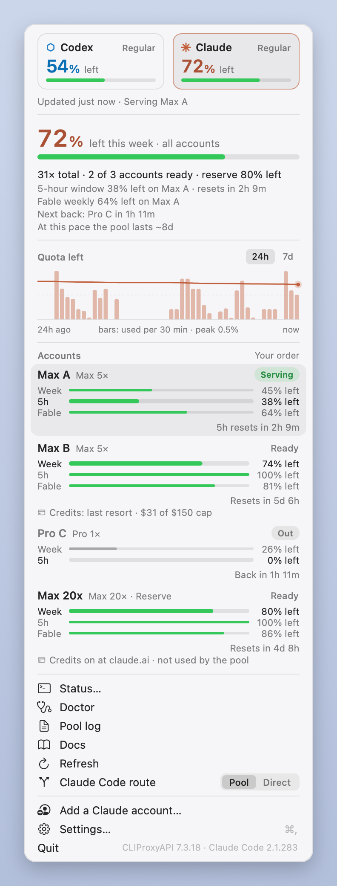
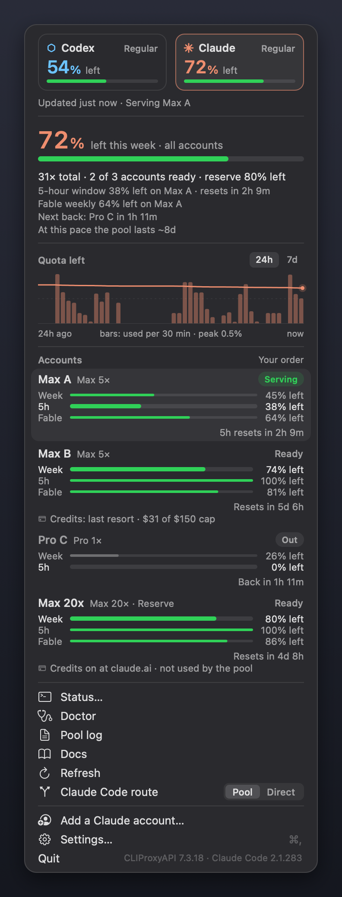
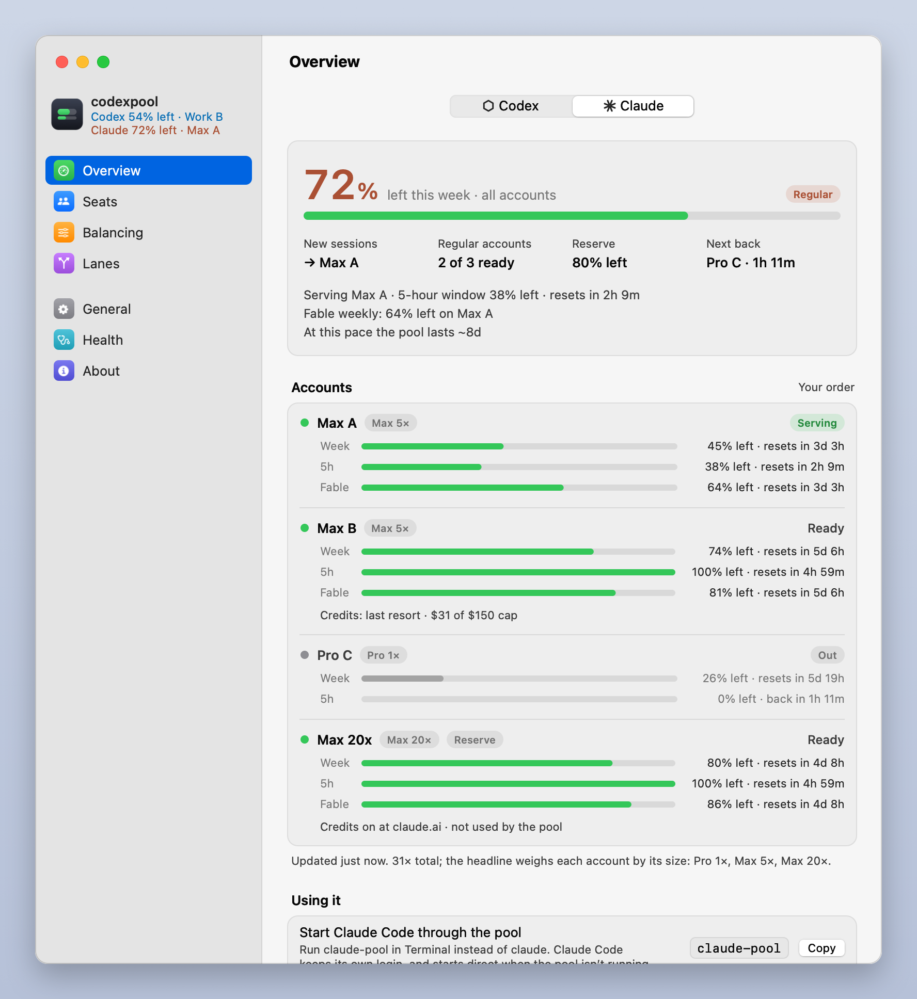

# The Claude pool in the menu bar and in Settings

Part of the sienna add-on (`menubar_ext.py`, a `PoolUI` the menu bar app and the Settings window load). The
core's `docs/MENUBAR.md` describes the apps themselves; this is what changes with the Claude pool installed.

  
  

## The Claude pool in the menu bar

With the [Claude pool](SIENNA.md) installed, the item shows two numbers, `⬡ 54%   ✳ 71%`: what is left this week
in the Codex pool and in the Claude pool, each after its logo. The logos come from the Codex and Claude apps
installed on your Mac (the app reads each one's own icon and draws it flat in the pool's colour; subpool bundles
none), with a simple drawn mark, a hexagon for Codex and an asterisk for Claude, when an app isn't there. An app
installed or updated later shows up within ten minutes. Each number is in its pool's own colour (blue for Codex, coral for Claude) while a regular seat or account serves,
turns red while that pool's reserve serves, the pool is all out or an account spends usage credits as the last
resort, and turns grey with a warning triangle when that pool is down or not reporting. The item keeps a fixed width.
Without the Claude pool, the item is exactly the one described above.

Click the left half for the Codex pool, the right half for the Claude pool. The popover opens with two tiles at the
top, Codex and Claude, each with its number, its state and a thin bar; the selected one is highlighted, and the rest
of the popover is that pool's. On the Claude tab the accounts show a 5-hour, a weekly and, where the plan has one, a
scoped weekly bar (such as a Fable cap), a plan badge (`Pro 1×`, `Max 5×`, `Max 20×`, `Team …`) and their credits
("Credits: last resort, cap $150"). When usage credits are on at claude.ai for an account whose policy here is
Off, its row warns **Turn credits off at claude.ai (Settings → Usage)**, a parked account's too: subpool parks
the account at its plan limit, but a proxy can't stop every paid request, so only turning them off there does
(hover the row for the full note; Doctor lists it as a problem). The menu bar itself does not change for it. An
account's menu offers **Enable (spends credits)…** only for an account parked with credits off (it asks first, then
`subpool claude enable` overrides the park until the limit resets); an account parked by its last-resort policy
shows **Serves once every other account is out** in its place, greyed, with the reason on hover: the guard brings it
back on its own once every other account's plan quota is spent, the reserve's included, and `subpool claude
enable` can't override that. To use it sooner, change its credit policy in Settings → Balancing. The
footer adds **Route: Pool / Direct** (where new Claude Code sessions go, after a confirmation), and **Add a Claude
account…** replaces Add a ChatGPT account….

With the Claude app on your Mac, the footer also has **Desktop · Pooled | Claude.ai**: whether the [Claude desktop
app](DESKTOP.md) runs on the pool (Chat, local Cowork and Code on the pool's accounts, in a separate profile) or on
its own claude.ai account. The segment is what the app's files say; the caption under it is what the running app
is actually doing, from its own log: "On the pool · Chat, Cowork and Code · history in Claude-3p" only once the app
has logged the pool's address, "Configured for the pool · reopen Claude to switch" with **Reopen Claude…** while a
running app still has the old mode, "On its own claude.ai account" only once it runs that way. Choosing the other
segment asks first ("Switch the desktop app to the pool?", "Go back to Claude.ai?"), then subpool quits and
reopens Claude itself (`subpool claude desktop pooled|claudeai --relaunch --yes`); the caption says "Switching
Claude to the pool…" meanwhile, then "Claude opened on the pool". Under a pooled desktop the row warns in orange
when credits are on at claude.ai for an account ("… the pooled app can spend them"), and notes an edited "Pool"
configuration; what subpool would refuse (those two, an interrupted change, a pool that is down) is said before
Claude is quit, with Run Doctor. When the Claude pool is down and the desktop is pooled, the banner says the app
can't answer and offers **Back to Claude.ai**. The control is not shown while the app is not installed, or with a
guard that doesn't report on it yet.

### The Claude pool in Settings

Switch Overview, Seats or Balancing to **Claude** for the [Claude pool](SIENNA.md). If it isn't installed yet, each
of them says what it is and offers **Set Up the Claude Pool…**, which opens the Setup assistant on its Claude side.

| Pane | Claude side | You can |
|---|---|---|
| **Overview** | The Claude headline (what is left this week across your accounts, weighted by size: Pro 1×, Max 5×, Max 20×), the account new sessions go to, the serving account's 5-hour window and scoped caps, the next account back, the pace; every account with its weekly, 5-hour and scoped bars and its credits. When the pool is down, not reporting or empty: why, and Check Health or Add a Claude Account…. Then **Using it**: start Claude Code with `claude-pool`, what keeps working (claude.ai connectors, artifacts, Claude in Chrome) and what doesn't (Remote Control, which needs a direct session: `CLAUDEPOOL=off claude`), the route, and, with the Claude app installed, **Desktop** (the [pooled desktop app](DESKTOP.md): the same Pooled \| Claude.ai control and honest caption as the popover, its warnings, **What changes when the app is pooled**, and while pooled **Import claude.ai history…**) | Copy `claude-pool`; Route for new sessions, **Pool** or **Direct** (`subpool claude route pool\|direct`); running sessions stay where they are. Desktop: **Pooled** or **Claude.ai** (a confirm, then `subpool claude desktop pooled\|claudeai --relaunch --yes`: subpool quits and reopens Claude), **Reopen Claude…** (`claude desktop relaunch --yes`), **Set Up…**, **Check Health**; **Import claude.ai history…** (off by default; the confirm says the wizard stores its own sign-in in the pooled profile; `claude desktop pooled --import --relaunch --yes`) |
| **Seats** | The accounts in fill order; pick one for its settings | Name (`subpool claude label`), Size (`claude weight`), In rotation (`claude enable`, `claude disable`; an account parked with credits off asks first, since enabling it can spend credits; one parked by its last-resort policy can't be enabled at all, so the switch is off and disabled and the row says when it serves), Sign In Again… (the Setup assistant), Remove… (`claude remove --yes`, after a confirmation; your Claude account and Claude Code's own login are not touched), Add Account…; its Fill order and Usage credits rows open Balancing (Usage credits also says, in full, when credits are on at claude.ai for an account whose policy is Off: turn them off there) |
| **Balancing** | How the pool picks an account, the account order, the reserve, and **Usage credits** | Your order or Soonest reset first (`subpool set claude_balancing priority\|reset`), move accounts up or down (`subpool claude order`), Use last (reserve) (`claude reserve`, `--off`), and each account's credit policy |

**Usage credits.** Each account is **Off** (the default) or **Last resort, up to $___**:

- *Off*: an account at its plan limit is parked until the limit resets, so it never spends usage credits
  (`subpool claude credits SEAT off`, which runs as soon as you pick it).
- *Last resort*: the account is used only after every account's plan quota is spent, the reserve's included. Then
  it spends usage credits until another account comes back or it reaches the cap, where subpool stops it. Picking
  **Last resort…** (or **Change Cap…**) opens a sheet that asks for the monthly cap in dollars and runs
  `subpool claude credits SEAT last-resort --cap N` only when you click Allow Credits. The sheet says so when
  credits are off for that account at claude.ai (then it can't spend any until you turn them on there), and
  reminds you that claude.ai's own monthly limit applies too.

Each row shows what claude.ai reports (credits on or off, and how much was used this month), and **Spending
credits** in red while the last resort is serving.

### Claude as a lane

**Claude as a lane** (the [read-only engine](ENGINE-LANE.md), provider
`sienna`): the provider is called **Claude** everywhere here, its members say `Claude · claude-opus-5-5 · read-only`,
and their state pill is the engine's: **Engine OK**, or **Not accepted** until the installed Claude Code is accepted
once, by version. Add Model offers Claude with a typed model id (the engine has no catalog to list) and says the
engine is accepted after saving. Credentials shows **Claude** with "Not accepted yet · read-only, through the Claude
pool · used by sienna" and **Accept Engine…**: a confirm (one read-only probe turn through the Claude pool, one
request spent), then `subpool lane apply --accept-engine` streams into a sheet like a lane test. Do it again after
a Claude Code update. Other engine states say what to do: no Claude Code, no pool launcher, pool down, apply lanes
first (hover the member row for the fix).

## The Setup assistant

On the assistant's second step:

   The **ChatGPT | Claude** switcher under the heading moves the step to the Claude pool: **Add a Claude account**
   runs `subpool claude login <name> --no-open` the same way (with `CODEXPOOL_NO_CLIPBOARD=1`, since the assistant
   copies the link itself), with the same link, private window, countdown and Copy Link, and ends with the
   account's plan (`Max 5×`) and Mark as Reserve. If the Claude pool isn't installed yet, the step offers **Install
   the Claude Pool**, which runs `subpool claude install` with its output streaming into the card (Stop ends it;
   installing again picks up from there), and then goes on to adding accounts.
3. **Done**: **Quit and Reopen Codex…**, so the app goes through the pool, and where to find Settings later. With
   the Claude pool installed, it also shows `claude-pool`, the command that starts Claude Code through it.

## Snapshots

Snapshots take `--pool claude` (the switcher's side; the Setup assistant's too), `--pool-status PATH` and `--pool-history PATH`
(the demo files are `docs/images/demo/claude-status-*.json` and `claude-history-*.jsonl`, with made-up accounts). Without
`--pool-status` a snapshot has no Claude pool, so its Claude side reads as not installed; it never reads the live
`claude-status.json`. Claude-only panes: `setup-install` and `setup-installing` (a made-up install in progress),
`balancing-credits` and `balancing-credits-warn` (the credits sheet over Balancing, on an account whose credits are on or
off at claude.ai) and `overview-desktop` (the Claude Overview with the Desktop row's "What changes" open). A
`claude-status.json` with a `pool.desktop` block draws the Desktop control in the popover's Claude tab and in the Claude
Overview (the demo files have none). `subpool_settings.py --pane setup-accounts --pool claude` starts on Add a Claude
account.
