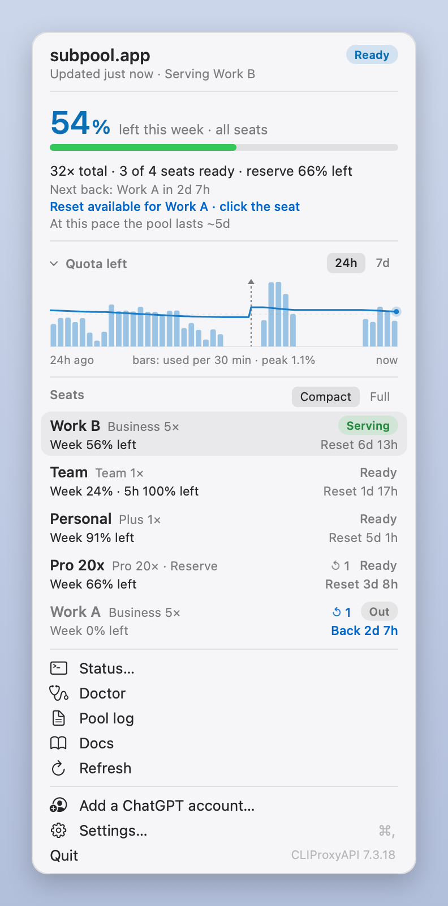
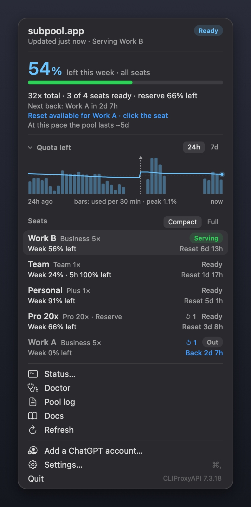
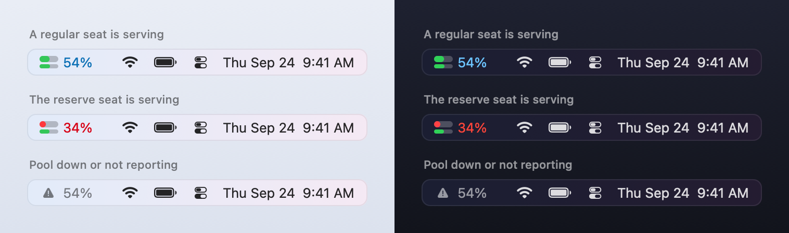
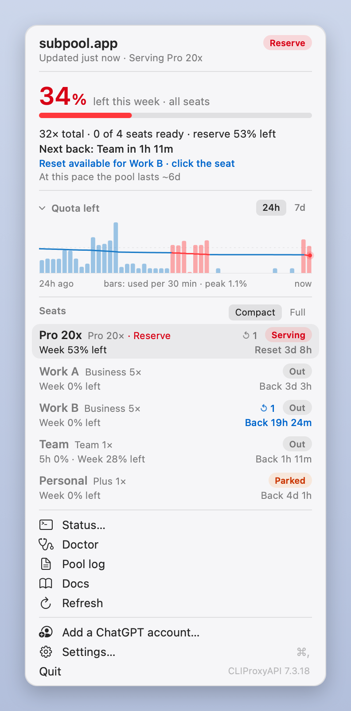
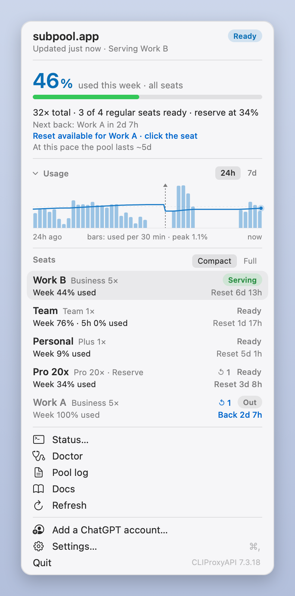
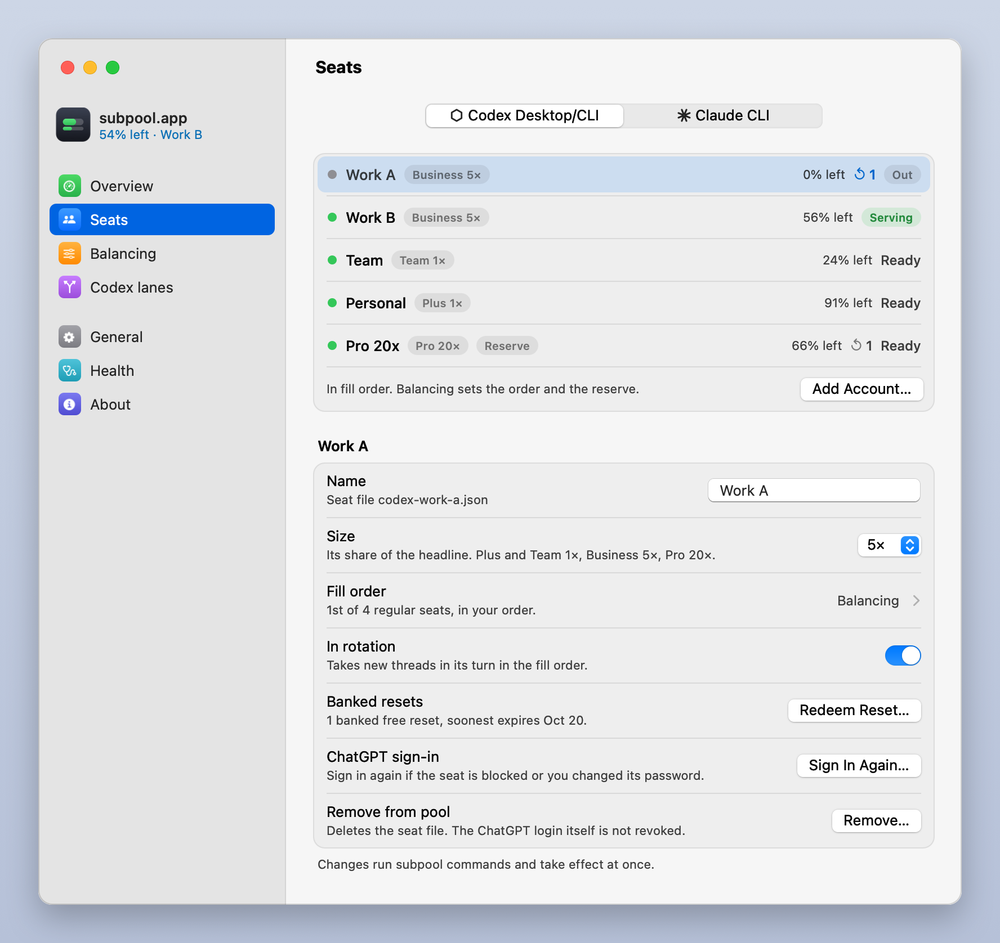
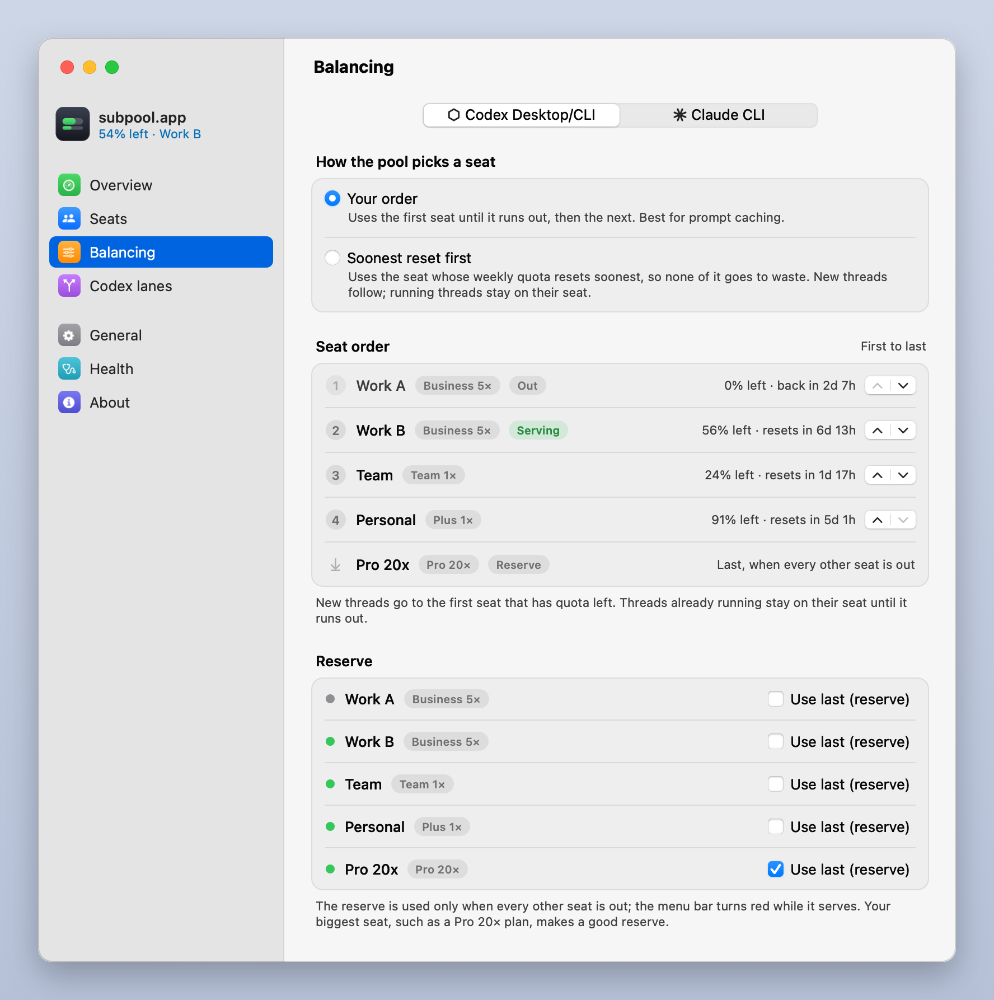
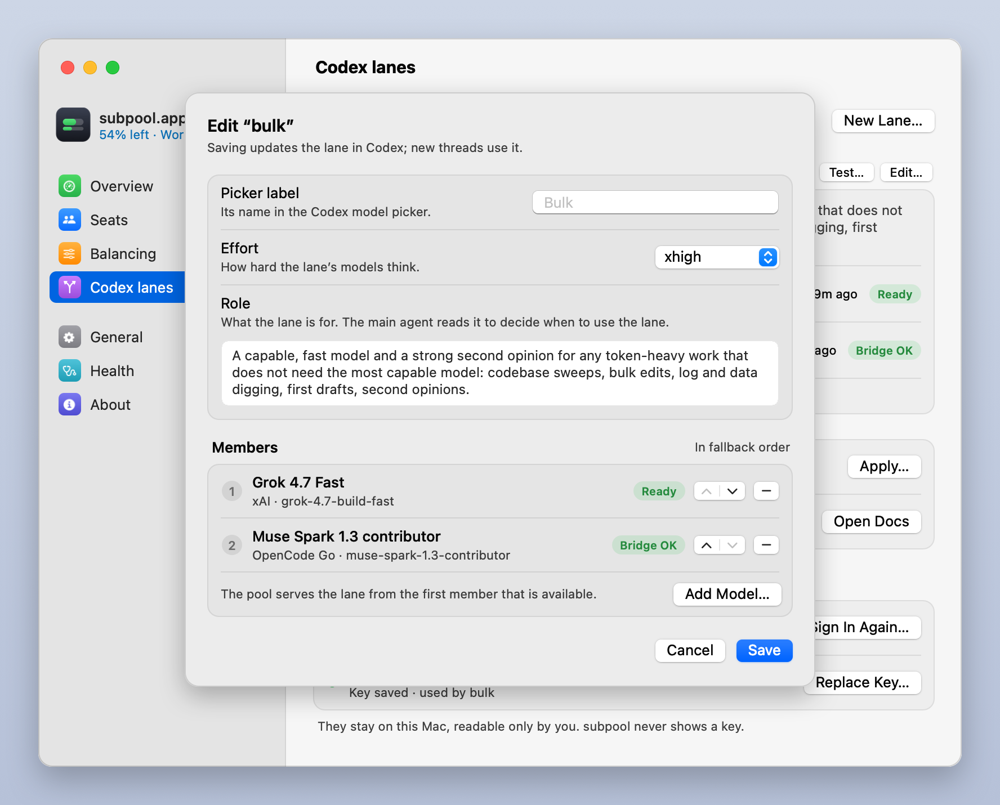

# The menu bar app and the Settings window

subpool's Mac apps are written in Python with PyObjC, no Xcode: the menu bar item next to the clock
([`menubar/subpool_menubar.py`](../menubar/subpool_menubar.py)), and the [Settings window](#the-settings-window)
and [Setup assistant](#the-setup-assistant) it opens
([`menubar/subpool_settings.py`](../menubar/subpool_settings.py)). `subpool install` sets them up and launchd
keeps the menu bar item running. The design spec, for anyone changing them, is
[`menubar/SPEC.md`](../menubar/SPEC.md).

- [What it can touch](#what-it-can-touch)
- [The item next to the clock](#the-item-next-to-the-clock), [the popover](#the-popover),
  [seat actions](#seat-actions) and [add-on pools](#add-on-pools)
- [The Settings window](#the-settings-window): [Balancing](#balancing), [editing lanes](#editing-lanes),
  and [the Setup assistant](#the-setup-assistant)
- [Running it](#running-it), [snapshots](#snapshots), [SwiftBar or xbar instead](#swiftbar-or-xbar-instead)

<p>
  
  
</p>

## What it can touch

It reads `~/.subpool/state/status.json` (the guard rewrites it every 60 seconds), `state/history.jsonl` for the
chart, and `settings.json` only to find the Python that runs subpool. With an [add-on's pool](ADDONS.md) installed
it also reads that pool's status and history files, which the guard writes the same way. The `headline` and `display` settings reach
it through `status.json`, where the guard copies them. It never touches the Keychain, never
calls the network and never talks to the pool's management API. Actions run the `subpool` command in the
background, or open Terminal for commands that need one. The Settings window and the Setup assistant follow the
same rules; they also read what `subpool doctor --json`, `subpool lane list --json`,
`subpool lane providers --json`, `subpool lane models PROVIDER --json` and `subpool version` print. A
provider key you paste into the Lanes pane goes to `subpool lane key NAME -` on its standard input: never on a
command line, never in a file.

## The item next to the clock



- **The number** is how much of this week's quota is left across all your seats, weighted by seat size. With
  `"display": "used"` it shows how much is used instead, and with `"headline": "regular"` it leaves the reserve out.
  The README explains [how it is computed](../README.md#the-headline-number-weights-and-the-reserve).
- **Green** while a regular seat serves, **red** while the reserve serves (the regular seats are spent), **grey
  with a warning triangle** when the pool is down, the guard has not reported for 3 minutes, or every seat is out.
- **The meter** left of the number has two bars: the number itself on top (red, like the number, while the
  reserve serves), the serving seat's week below. They drain as the quota is used (with `"display": "used"` they
  fill).

The item has a fixed width, so its neighbours never shift as the number changes. On first run it asks macOS
for the rightmost spot among third-party items; ⌘-drag it anywhere and it stays there.

## The popover

Click the item. Click it again, or anywhere outside the popover (another app, the desktop), or press Escape to
close it; it also closes when you switch to another app.

The account list starts in **Compact**, with two lines per account. **Full** restores every quota bar;
the detailed screenshots below show that view. The usage graph starts expanded in either view. Click
its title or arrow to collapse it to a heading, or click again to restore it. The app remembers the
account view and graph choice separately. Hover over a compact account row to see all its limits.

1. **Header**: "subpool.app", when the status was last updated and which seat is serving. The pill on the right
   says `Regular` (green), `Reserve` (red), or `All out`, `Down`, `Stale`, `No seats`, `No data` (grey). After
   you use an action, the subtitle shows its progress and result for a few seconds.
2. **Problem banner** when something needs you: pool down (**Restart Pool**), not reporting (**Run Doctor**) or
   no seats yet (**Add Account…**, which opens the [Setup assistant](#the-setup-assistant) at its Add accounts
   step).
3. **Headline**: the big percentage ("54% left this week · all seats") and its bar, then
   - "3 of 4 regular seats ready · reserve 66% left",
   - "Next back: Work A in 2d 7h" when a seat is out (in bold when every regular seat is out),
   - "Reset available for Work A · click the seat" in blue when a seat that can't serve has a banked reset,
   - the pace from recent history: "At this pace the pool lasts ~5d" ("the regular seats last" with
     `"headline": "regular"`), or "Steady". Weekly resets are ignored when working out the slope.

   Hover over the number or its bar for the breakdown, one line per seat in fill order, then the result:

   ```
   Work A · 5× · 0% left · back in 2d 7h
   Work B · 5× · 56% left · serving · resets in 6d 13h
   Pro 20x · 20× reserve · 66% left · resets in 3d 8h
   Weighted by size: 54% left · all seats
   ```

   With `"headline": "regular"` the reserve's line reads "Pro 20x · reserve, not counted · 66% left".
4. **Chart** ("Quota left", or "Usage" with `"display": "used"`), over 24 hours or 7 days (toggle). The bars
   are your use: how much of the pool's quota went in each half hour (each 4 hours over 7 days), the busiest one
   reaching the top; the caption under the chart says what the tallest bar is worth ("peak 1.1%"). The line is the
   same figure as the number, on a 0–100 % scale, so what is left falls as you work and jumps up at a weekly
   reset; a reset is marked with a dashed line and a small triangle, and never counts as use. Both are blue where
   a regular seat served and red where the reserve did. The chart needs a few samples first and says
   "Collecting history…" until then.
5. **Seats**, in fill order. Each row has the seat's name, its plan and weight (`Business 5×`), a `· Reserve` tag,
   and its state: `Serving`, `Ready`, `Out`, `Parked`, `Blocked` or `Off`. Below that is the weekly bar and how much
   is left ("56% left"); a seat with a 5-hour window has one labelled row per limit instead ("Week", "5h", each
   with its own bar and "% left", the limit that binds the seat bolder), and when it resets or comes back. Bars drain as a seat is used: green above 30% left, orange at 30% or less, red at 10%
   or less, and grey for a seat that can't serve. A seat that needs a new sign-in says "Re-login needed" and shows
   the error. "Re-login soon" (orange) is a seat whose sign-in OpenAI ended but that still serves until its access
   runs out, within a day: sign in again before then.
6. **Footer**: Status… (Terminal, `subpool status --live`), Doctor, Pool log (`subpool logs -f`), Docs (the
   README), Refresh (runs one guard pass now); then **Add a ChatGPT account…** (the Setup assistant's Add
   accounts step), **Settings…** (⌘,, which also works while the popover is open), Quit, and the running
   CLIProxyAPI version.

If the popover is taller than the screen, only the seat list scrolls.

**When the reserve takes over** everything turns red: the pill, the headline number and its bar, the meter's top
bar and the reserve's `Serving` capsule. The chart shows red stretches where the reserve served (and where every
seat was out). In this example Work A and Work B are out, Team has hit its
5-hour limit, Personal is parked by the credit guard, and Work B has a banked reset that would bring it back now.



**Used instead of left.** With `"display": "used"` in `settings.json` every number counts up from 0% and the
bars fill: the same pool reads 46% used, the seats "100% used" and "Week 76% · 5h 0%", and the bars turn orange at
70% used and red at 90%. Add `"headline": "regular"` to leave the reserve out of the number as well.



## Seat actions

Click a seat row for its menu. The first line shows the seat's label and account.

| Item | When | What it runs |
|---|---|---|
| **Use reset now… (n banked, expires Oct 3)** | the seat has banked free resets | asks first, then `subpool reset <seat> --yes` |
| **Re-login…** | always (near the top when the seat is blocked or says "Re-login soon") | Terminal: `subpool login <Label> --no-open --priority <current>` |
| **Enable (spends credits)…** | the credit guard parked the seat | asks first, then `subpool enable <seat>` |
| **Enable** / **Disable** | the seat is off / on | `subpool enable` / `subpool disable` |
| **Make first** | any regular seat that isn't already first | `subpool priority <seat> <top + 10>` |

**Resets.** A seat with banked resets shows `↺ n` next to its state, blue when the seat can't serve (that is when
a reset helps). Hovering shows how many are banked and when the soonest expires. **Use reset now…** asks "Use a
reset on Work B?" and explains that it uses one of the banked free resets and never buys one. After you confirm,
the seat's weekly and 5-hour limits go back to full and the pool can use it right away. If the seat didn't need a
reset, ChatGPT declines and the credit is kept; the header shows the reason.

**Re-login** opens Terminal with the sign-in link printed rather than opened, and reminds you which account to
use: open the link in a private window and sign in to that account. The link is on the clipboard too, so you can
paste it straight into the private window. It passes the seat's current priority back, because a new login
rewrites the seat file that holds it.

**Make first** is disabled for reserve seats: moving the reserve first would drain it before the regular seats.

After any action the app runs one guard pass, so the popover shows the effect at once.

## Add-on pools

With an [add-on](ADDONS.md) that provides a second pool installed, one item shows both: two numbers, each after its
pool's mark and in its pool's colour, by the same rules; click the left half for the Codex pool, the right half for the
other. The popover opens with a tile per pool at the top, and the rest of the popover is the selected pool's. The
Settings window's Overview, Seats and Balancing panes get a pool switcher, and `subpool gui PANE --pool ID` opens
them on that pool. Without an add-on, the item and the window are exactly as described here. What the second pool's
tab and panes show is the add-on's own documentation.

## The Settings window

A window in the style of System Settings: a sidebar with the pool's number and serving seat, and seven panes. It
shows the same data as the popover, in the same colours, and every change it makes is a `subpool` command run
in the background, the same one you could type in a terminal. With an [add-on's pool](#add-on-pools) installed, Overview, Seats and
Balancing have a pool switcher at the top (it remembers your choice) and the sidebar shows a line for each pool.



**Open it** with **Settings…** (⌘,) in the popover, or with `subpool gui` from a terminal
(`subpool gui seats` opens it on a pane, `subpool gui seats --pool ID` on an add-on pool's side of it). Only one
runs at a time: opening it again brings the open window forward on the pane you asked for. While it is open it has a Dock icon and a menu bar of its own, with ⌘1 to ⌘7
for the panes. Closing the window quits it.

| Pane | Shows | You can |
|---|---|---|
| **Overview** | The headline number and its bar, the seat new threads go to, how many regular seats are ready, the reserve, the next seat back, a banked reset you could use, the pace, and every seat with its plan, size, weekly and 5-hour bars and reset times | When the pool is down, not reporting or has no seats: Restart Pool…, Check Health or Add a ChatGPT Account… |
| **Seats** | The seats in fill order; pick one for its settings and its place in the fill order | Rename it (`subpool label`), set its Size (`weight`), switch In rotation (`enable`, `disable`; a parked seat asks first, since it would spend credits), Redeem Reset… (`reset --yes`, after saying it spends one banked free reset and never buys one), Sign In Again… (the Setup assistant, keeping the seat's name and priority), Remove… (`remove --yes`, after a confirmation), Add Account…; its Fill order row opens Balancing |
| **Balancing** | How the pool picks a seat, the fill order (with each seat's week left and reset) and the reserve | Your order or Soonest reset first (`subpool set balancing priority\|reset`), move seats up or down (`subpool order`), Use last (reserve) per seat (`reserve`, `--off`). [More below](#balancing). |
| **Lanes** | Each [lane](LANES.md): its name in the model picker, effort, role, members in order with their state and last test, and the lane's own last test; then the provider sign-ins and keys | New Lane… and Edit… (a sheet, below), Test… (confirms first, since it spends lane quota and can take minutes; the output streams into a sheet with Stop), Delete… (`lane remove`, after a confirmation), Apply… (`lane apply`), Open Docs, and per provider Sign In… / Add Key… / Replace Key…. [More below](#editing-lanes). |
| **General** | The menu bar settings | Numbers show Left or Used (`subpool set display`), Headline covers All seats or Regular seats (`subpool set headline`), Restart… the pool, Open Logs, Reopen Codex… (quits the Codex app and opens it again), open the Setup assistant |
| **Health** | `subpool doctor`'s report: a summary, then each check with ✓, ! or ✗ and how to fix it | Run Again, Copy Report (the full text, which stays on your Mac until you paste it) |
| **About** | The subpool and CLIProxyAPI versions, links to the website, source, docs and issues, the license and the disclaimer | |

A change takes effect at once: the window runs one guard pass after it and shows the result inline. If a command
the window needs is missing (an older `subpool`), the pane says "This needs a newer subpool" instead: run the
installer again. The window's output goes to `~/.subpool/logs/settings.log`.

### Balancing



**How the pool picks a seat.** *Your order* uses the first seat until it runs out, then the next, which is best
for prompt caching (the default, `subpool set balancing priority`). *Soonest reset first* uses the seat whose
weekly quota resets soonest, so quota that would expire unused gets used first (`subpool set balancing reset`).
Either way new threads follow the order, while threads already running stay on their seat until it runs out.

**Seat order.** In *Your order* the arrows move a seat up or down; a burst of clicks is saved once, as one
`subpool order` with every regular seat in the new order. In *Soonest reset first* the list is read-only: it
shows the order the guard computed, re-sorted every minute by weekly reset, with seats that have no usage data
after the others in your order. Switching back to *Your order* brings your own order back. The reserve is always
last.

**Reserve.** Tick *Use last (reserve)* for the seat the pool should keep until every other seat is out
(`subpool reserve`, `--off` to clear it). A big seat, such as a Pro 20× plan, makes a good reserve. The menu bar
turns red while it serves.

### Editing lanes



**New Lane…** (at the top of the Lanes pane, and in its empty state) and **Edit…** on a lane open the lane editor:
the name (new lanes only), the picker label (its name in the Codex model picker; empty means the lane name with a
capital first letter), the effort, the role (what the lane is for; the main agent reads it) and the members in
fallback order, with arrows to reorder them and − to remove one. **Add Model…** picks a provider, lists its models
with `subpool lane models` (or type a model id by hand) and takes a display name; a provider that isn't ready
offers **Sign In to xAI…** or **Add Key…** right there. A model the lane already has is refused, and so is a second
new Responses endpoint before the first is saved. **Save** runs one command, `subpool lane add` for a new lane or
`subpool lane edit` with the changes, which writes `lanes.json` and applies it; if it fails, the sheet stays open
and shows what subpool said. When the lane still needs a key (a new responses member has a key of its own,
named after the lane), the sheet asks for it right there and saves once it is in. **Cancel** discards the changes. Start a new Codex thread to use a
changed lane.

**Credentials**, at the bottom of the pane, lists each provider a lane uses or that is ready, with its state:
**Sign In…** for xAI runs `subpool lane login xai --no-open` and shows the link with Open in Browser, Open in
Private Chrome Window and Copy Link, like the Setup assistant (the link goes on the clipboard at once).
**Add Key…** and **Replace Key…** take the key in a secure field and pipe it to `subpool lane key NAME -`; the
field is cleared as soon as it is sent, or when you cancel. Apply the lanes after a new key so the bridge reads it.

## The Setup assistant

A three-step window for adding ChatGPT accounts (and, with an add-on's pool, its accounts: the switcher on its second
step). It
opens:

- by itself at the end of a first install with the one-liner, when it runs in Terminal on the Mac itself;
- once by itself from the menu bar app, the first time it sees the pool running with no seats (it records that in
  `state/setup-shown` and never opens on its own again);
- from **Add a ChatGPT account…** in the popover (at step 2), **Setup Assistant…** in the Settings window's
  menu, the General pane, or `subpool gui setup-welcome`.

1. **Welcome**: what subpool does, and a checklist from `subpool doctor` (pool running, Codex app pointed at
   the pool, menu bar running), with the fix for any check that fails.
2. **Add accounts**: the seats already in the pool, then a name field and **Get Sign-In Link**, which runs
   `subpool login <name> --no-open --no-copy` in the background. The link goes on the clipboard as soon as it
   appears ("Copied" shows next to **Copy Link** while it is still there). Open it in the browser or in a private
   Chrome window (when Chrome is installed), or paste it; to add an account other than the one your browser is
   signed in to, use a private window. **Copy Link** copies it again. The link is good for 5 minutes, with Try
   Again after that. Once you have signed in, the
   assistant shows the seat's plan and size, and offers **Mark as Reserve** and **Add Another…**. If the browser
   signed in to an account that is already a seat, nothing is added: it says so and gives that seat its old name
   back.


`subpool setup` is the same flow in a terminal. The README shows the Add accounts step
([Install](../README.md#install)).

## Running it

The LaunchAgent (label `menubar_label` in `settings.json`, default `com.subpool.menubar`) runs
`<menubar_python> ~/.subpool/menubar/subpool_menubar.py` at login and restarts it if it crashes. **Quit** in
the popover stops it until your next login.

```sh
launchctl kickstart -k gui/$(id -u)/com.subpool.menubar    # restart (after editing or upgrading)
launchctl print gui/$(id -u)/com.subpool.menubar           # is it loaded and running?
tail -f ~/.subpool/logs/menubar.log                        # its log
```

The interpreter needs `pyobjc-core` and `pyobjc-framework-Cocoa`; the installer puts them into subpool's venv.
To start it again after **Quit** without logging out:

```sh
launchctl kickstart gui/$(id -u)/com.subpool.menubar
```

If the item doesn't appear, see [Troubleshooting](TROUBLESHOOTING.md#the-menu-bar-item-is-missing).

The Settings window is not a LaunchAgent: the menu bar app, `subpool gui` or the installer start it when you
open it, with the same interpreter (`menubar_python`), and it quits when you close its last window.

## Snapshots

The app can render its popover and item to PNG without showing any UI, which is how the screenshots here were
made (from synthetic data in `docs/images/demo/`):

```sh
~/.subpool/.venv/bin/python ~/.subpool/menubar/subpool_menubar.py \
    --snapshot /tmp/popover.png --appearance dark
```

Options: `--status PATH` and `--history PATH` (default: the live files), `--now ISO-8601`, `--range 24h|7d`,
`--max-height PT` (simulates a short screen), `--hover seat:<seat file>` or `--hover action:doctor`
(`--hover tip:headline` prints the headline's breakdown tooltip, which can't be drawn offscreen). It writes
`OUT.png` (the popover) and `OUT-menubar.png` (the item), both at 2×. The headline and display modes come from the
status file, as in the running app; `docs/images/demo/status-used.json` is the demo pool with `"display": "used"`.
`--marks app` draws the pools' logos from the apps on your Mac, as the running app does; the default, `drawn`, uses
the plain marks and reads nothing from `/Applications`, so snapshots come out the same on every Mac.

The Settings window and the Setup assistant do the same, and run no command while they do:

```sh
~/.subpool/.venv/bin/python ~/.subpool/menubar/subpool_settings.py \
    --snapshot /tmp/seats.png --pane seats --appearance light --status docs/images/demo/status-regular.json
```

`--pane` takes any pane, a Setup assistant step (`setup-welcome`, `setup-accounts`, `setup-signin`,
`setup-added`, `setup-again`, `setup-done`, and an add-on's own panes), or one of the Lanes pane's sheets over the pane: `lanes-edit` (the
lane editor on the first lane, or on `--lane NAME`), `lanes-new`, `lanes-model`, `lanes-model-key` and
`lanes-model-engine` (Add Model on a provider that is ready, on one that needs a key, and on an engine provider), `lanes-key`
(Add Key) and `lanes-signin` (the xAI sign-in, with a made-up link). Add `--doctor PATH`, `--lanes PATH`, `--providers PATH` and `--models PATH` (the JSON that
`subpool doctor --json`, `subpool lane list --json`, `subpool lane providers --json` and
`subpool lane models PROVIDER --json` print; demo files are in `docs/images/demo/`), `--history PATH` for the
pace line, `--now ISO-8601`, `--height PT` and `--marks drawn|app` (the switcher's marks, as above). Without
`--status` it renders the live `status.json`;
`docs/images/demo/status-reset.json` is the demo pool with `"balancing": "reset"`. For an add-on's pool add
`--pool ID` (the switcher's side; the Setup assistant's too), `--pool-status PATH` and `--pool-history PATH` (its own
demo files). Without `--pool-status` a snapshot has no second pool, so that side reads as not installed; it never
reads a live add-on file.

Outside snapshots, `--pool codex|ID` opens the window, or the Setup assistant, on that pool.

To rebuild every image in `docs/images/`:

```sh
~/.subpool/.venv/bin/python docs/images/demo/render.py
```

## SwiftBar or xbar instead

`subpool menubar` prints plugin output for SwiftBar or xbar: the serving seat and its usage (left or used, per
`display`), a line per seat
with enable/disable/re-login, and the usual Status, Doctor, Pool log and Restart items. The native app is the
supported path and the only one with the reset action.
